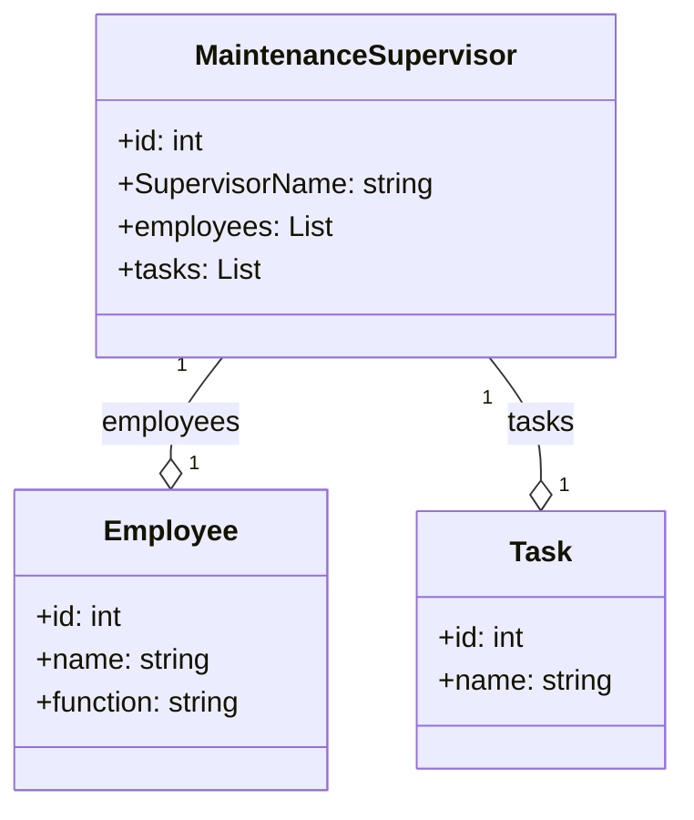

# Diagrama de classes utilizados no projeto

```mermaid
classDiagram
    class MaintenanceSupervisor {
        +id: int
        +SupervisorName: string
        +employees: List<Employee>
        +tasks: List<Task>
    }
    
    class Employee {
        +id: int
        +name: string
        +function: string
    }
    
    class Task {
        +id: int
        +name: string
    }

    MaintenanceSupervisor "1" --o "1" Employee : employees
    MaintenanceSupervisor "1" --o "1" Task : tasks

```

